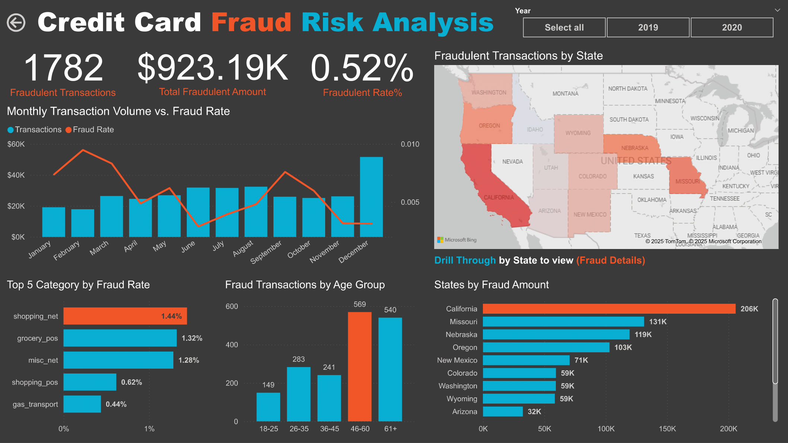
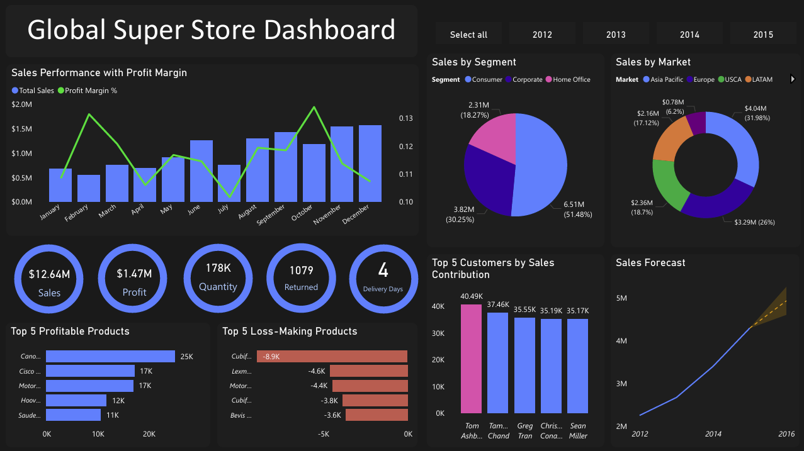
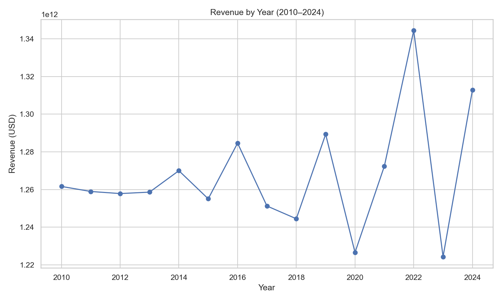

# Welcome to My GitHub Profile! 👋
## 👨🏻‍💻 ABOUT ME 
### Francis Yobel Sibal | Data Analyst
Detail-Oriented Professional with a background in Engineering and Data Analytics, with 1 year of experience working with metrics data in the manufacturing industry.
Specializing in data manipulation and analysis using SQL, Python, Microsoft Excel and Power BI for data visualization, building interactive dashboards and performance reports.

---

## 🔧 Technologies & Tools:
* **Data analysis and manipulation using SQL / Python / Excel**
* **Data visualization and data storytelling using Microsoft Power BI / Python**
* **Databases: MySQL, PostgreSQL, SQLite**

---
## 📂 My Projects
---

* **[Credit Card Fraud Detection Analysis](https://github.com/francissibal/Credit_Card_Fraud_Analysis)**

   This repository contains the end-to-end analysis of a credit card transaction dataset to identify and predict instances of fraud. The project combines SQL, and Microsoft Power BI for exploratory data analysis and visualization, with a focus on understanding fraud risk patterns and informing fraud       prevention strategies.
    * *Tools: SQL, Power BI, MySQL*

---

      
* **[Automated Data Pipeline: World's Largest Banks](https://github.com/francissibal/Worlds-Largest-Banks-ETL)**
  
  This project features a complete ETL (Extract, Transform, Load) pipeline built in Python. It automatically scrapes data on the world's largest banks from a live Wikipedia page, processes and transforms the data using Pandas to include multiple currency conversions, and then loads the results into a    CSV file and a SQLite database.
    * *Tools: Python, requests, BeautifulSoup, pandas, SQLite*
   #### Data Sample: World's Largest Banks by Market Capitalization
   | Rank | Name                                    | MC_USD_Billion | MC_GBP_Billion | MC_EUR_Billion | MC_INR_Billion |
   |------|-----------------------------------------|----------------|----------------|----------------|----------------|
   | 1    | JPMorgan Chase                          | 599.931        | 479.94         | 557.94         | 49992.25       |
   | 2    | Bank of America                         | 307.900        | 246.32         | 286.35         | 25657.31       |
   | 3    | Industrial and Commercial Bank of China | 303.543        | 242.83         | 282.29         | 25294.24       |
   | 4    | Agricultural Bank of China              | 232.836        | 186.27         | 216.54         | 19402.22       |
   | 5    | Bank of China                           | 209.295        | 167.44         | 194.64         | 17440.55       |

---

* **[Global Super Store Sales & Profitability Dashboard](https://github.com/francissibal/GlobalSuperStore)**
  
  A comprehensive sales dashboard providing a 360-degree view of a global retailer's performance. It visualizes $12.64M in sales by tracking monthly trends, segmenting performance by market and customer type, and offering actionable insights into profitability by highlighting profit margins and top/bottom performing products.
    * *Tools: Python, Power BI*
      

---

* **[BMW Sales Analysis](https://github.com/francissibal/BMW_Sales_Analysis)**
  
  This project analyzes BMW’s global sales data from 2010 to 2024, uncovering insights into revenue growth, regional sales performance, model profitability, and customer preferences. It includes data cleaning, exploratory analysis, and business recommendations supported by visualizations.
    * *Tools: Python, pandas, matplotlib, seaborn, Jupyter Notebook*

---

## 📞 Contact
#### 📫 Let's Connect!
I'm always open to discussing new projects, creative ideas, or opportunities. Feel free to connect with me!

* **LinkedIn:** [linkedin.com/in/francis-sibal](https://www.linkedin.com/in/francis-sibal/)
* **Email:** [francisyobel@gmail.com](mailto:francisyobel@gmail.com)

